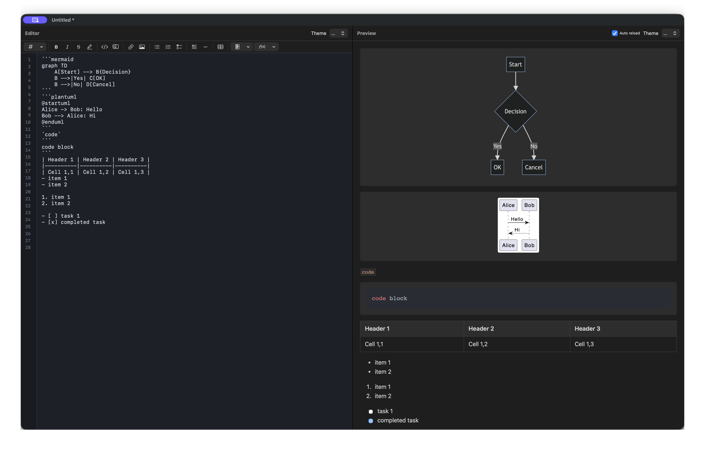

# MarkdownEditor

<p align="center">
  <a href="https://apps.apple.com/app/id6756916654"></a>
  
  
</p>

[한국어](README.md) | **English** | [日本語](README.ja.md) | [中文](README.zh.md)

A Markdown editor for macOS with live preview and scroll synchronization.

> Published on the Mac App Store as **MarkChartEditor**.
> [Get it on the App Store](https://apps.apple.com/app/id6756916654)

## Features

- **Live preview**: The editor and preview sit side by side, and edits show up right away.
- **Scroll sync**: Editor and preview follow each other by source line. Wheel, trackpad, and dragging the scrollbar all stay in sync.
- **Diagrams and math**: Mermaid, PlantUML, KaTeX formulas, and code highlighting.
- **Native macOS tabs**: The same tab experience as Safari and Finder.
  - Cmd+T for a new tab, Cmd+N for a new window
  - Drag a tab out to make it its own window
  - Window > Merge All Windows to bring them back together
- **Find and replace**: Search in both the editor and the preview, with matches highlighted.
- **Outline sidebar**: Jump to any heading from the list (Shift+Cmd+O).
- **Focus and typewriter modes**: Highlight only the current paragraph, or keep the cursor centered.
- **Auto save and external change detection**: Saves 3 seconds after you stop typing, and tells you when another app changes the file.
- **Export**: Save as PDF or HTML.
- **Images**: Drag and drop, paste, or pick a file (Ctrl+O).
- **Themes**: Choose light or dark for the editor and the preview separately.
- **Remember window size**: Reopens at the size you last set (turn it on in Settings > General).
- **Quick Look preview** (in-app purchase): Press space in Finder to read Markdown files as rendered pages.

## Screenshot



*Mermaid flowcharts, PlantUML sequence diagrams, tables, checklists, and more*

## Requirements

- macOS 13.0 (Ventura) or later
- Apple Silicon (M1/M2/M3) or Intel Mac

## Install

### Mac App Store (recommended)

[Get it on the Mac App Store](https://apps.apple.com/app/id6756916654)

### Build from source

See [Build](#build) below.

## Set as the default app

### From Finder

1. Right-click any `.md` file
2. Choose "Get Info"
3. Under "Open with", select MarkdownEditor
4. Click "Change All..."

### From Terminal

```bash
brew install duti
duti -s com.zerolive.MarkdownEditor .md all
duti -s com.zerolive.MarkdownEditor .markdown all
```

## Build

### Requirements

- Xcode 15.0 or later
- macOS 14.0 or later (build machine)

### Steps

```bash
git clone git@github.com:leonardo204/MarkdownEditor.git
cd MarkdownEditor

xcodebuild -project MarkdownEditor.xcodeproj -scheme MarkdownEditor -configuration Release build
```

### Create a notarized DMG

```bash
# Prerequisite: install create-dmg
brew install create-dmg

# Store the notarytool profile in Keychain (once)
xcrun notarytool store-credentials "notarytool" \
  --apple-id "your-apple-id@example.com" \
  --team-id "YOUR_TEAM_ID" \
  --password "app-specific-password"

# Build and package
./scripts/distribute.sh
```

## License

MIT License. See [LICENSE](LICENSE) for details.

## Contact

zerolive7@gmail.com
