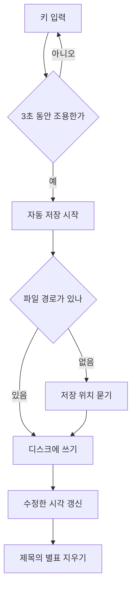
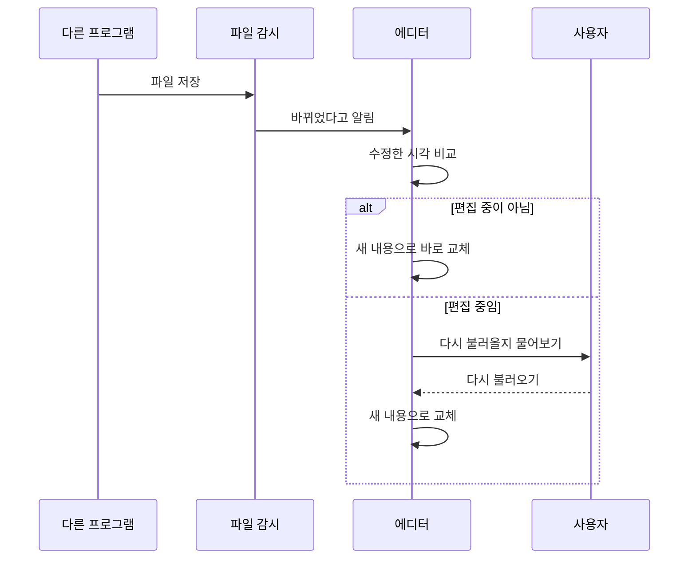
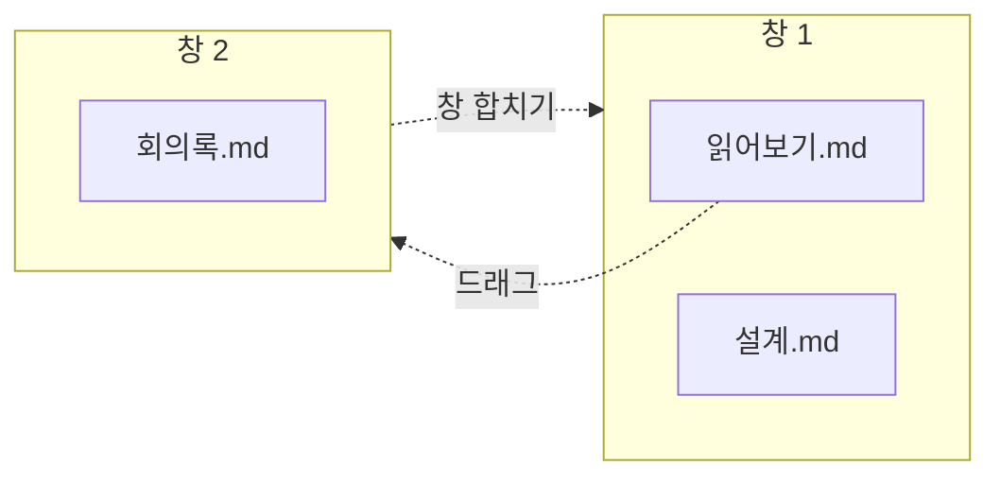
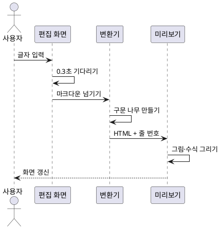

# 문서 저장 흐름

편집한 내용이 파일로 남기까지 어떤 길을 지나는지 그림으로 정리했습니다.

## 전체 흐름

## 외부에서 파일이 바뀌었을 때

## 탭과 창의 관계

## 미리보기가 그려지는 과정

## 만들면서 정한 것

| 항목 | 정한 값 | 이유 |
|---|---|---|
| 미리보기 갱신 대기 | 0.3초 | 타자 속도보다 느리게 잡아야 화면이 떨리지 않음 |
| 자동 저장 대기 | 3초 | 문단 하나를 끝낼 만한 시간 |
| 동기화 간격 | 0.016초 | 화면 주사율에 맞춤 |
